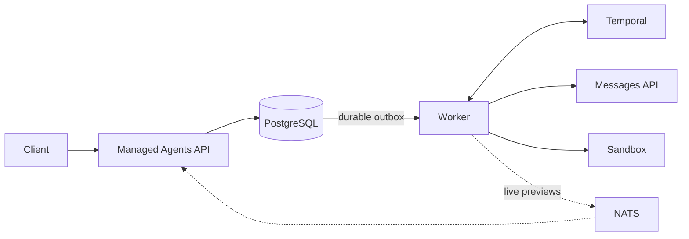

<p align="center">
  <picture>
    <source media="(prefers-color-scheme: dark)" srcset="assets/mango-logo-dark.svg">
    <source media="(prefers-color-scheme: light)" srcset="assets/mango-logo.svg">
    
  </picture>
</p>

<hr>

<p align="center">
  <strong>Open-source Claude Managed Agents runtime, built for durable self-hosting.</strong>
</p>

Mango is an independent implementation of the core Claude Managed Agents API
in Go. It runs agent sessions on your infrastructure with PostgreSQL-backed
state, Temporal-powered execution, and pluggable sandboxes.

## Why Mango

- **Compatible:** use the supported API through raw HTTP or the official
  Anthropic Go SDK with a different base URL.
- **Durable:** accepted work, interrupts, tool orchestration, and client-action
  waits survive process failures.
- **Pluggable:** run tools in local, Docker, E2B, CubeSandbox, OpenSandbox, or
  Daytona sandboxes.
- **Observable:** persist the event history and stream results over SSE.

## Quick start

Requirements: Docker with Compose.

```bash
make local-up
make local-health
curl http://localhost:8080/readyz
```

No credentials are required. The local stack runs PostgreSQL, Temporal, NATS,
the API, and a worker with a deterministic offline model.

Follow the [five-minute walkthrough](docs/getting-started.md) to create an
Environment, Agent, and Session and send the first message.

```bash
make local-down
```

## How it works



PostgreSQL owns public state and event history. Temporal owns in-flight
execution. NATS carries only ephemeral wakeups and previews. A lost signal,
worker restart, or NATS outage cannot discard accepted work.

This separation is consistent with the architecture Anthropic describes for
[Managed Agents](https://www.anthropic.com/engineering/managed-agents) and
Cursor's published lessons on
[durable cloud agents](https://cursor.com/blog/cloud-agent-lessons). These are
non-normative references, not endorsements or compatibility evidence.

Read the [architecture overview](docs/architecture.md) for the failure model,
transactional outbox, tool journal, interrupt ordering, and sandbox lifecycle.

## Current scope

> [!IMPORTANT]
> **Alpha.** Mango implements a documented subset of the API and is not an
> Anthropic product or a drop-in production service. Check the
> [compatibility matrix](docs/compatibility.md) before depending on a capability.
> The default local sandbox is not a security boundary.

| Area | Status |
| --- | --- |
| Agents, Environments, Sessions | Core lifecycle implemented |
| Events | Messages, interrupts, custom-tool results, confirmations, pagination, and SSE |
| Runtime | Multi-round model/tool loop with durable park and resume |
| Tools | Sandbox built-ins, provider-native Web Search/Fetch, and remote MCP tools |
| Sandboxes | Local and Docker available; E2B, CubeSandbox, OpenSandbox, and Daytona in Preview |

Web Search/Fetch currently require a supporting Messages API endpoint and
`always_allow`. MCP supports unauthenticated public Streamable HTTP servers;
deployment-managed authentication remains future work. Files, skills, memory,
vaults, multi-agent orchestration, schedules, and webhooks are not implemented.
See [Claude API coverage](docs/compatibility.md) for exact behavior and the
[roadmap](docs/roadmap.md) for planned work.

## Next steps

- [Use a real model endpoint](docs/getting-started.md#use-a-real-model-endpoint)
- [Choose a sandbox backend](docs/sandboxes.md)
- [Understand the deployment model](docs/deployment.md)
- [Browse the API reference](docs/api/overview.md)
- [Read the hosted documentation](https://yanpgwang.github.io/managed-agent-go/)

## Development

```bash
make verify
make docs-check
make image-smoke
```

Default tests are offline. PostgreSQL, Temporal, NATS, Docker, and remote
sandbox integrations have opt-in suites. See
[`deployments/local`](deployments/local/README.md) and
[CONTRIBUTING.md](CONTRIBUTING.md).

Report vulnerabilities through [SECURITY.md](SECURITY.md).

## License

Apache License 2.0. See [LICENSE](LICENSE).
