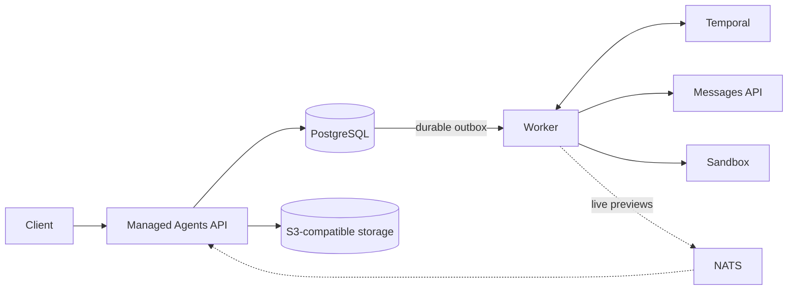

<p align="center">
  <picture>
    <source media="(prefers-color-scheme: dark)" srcset="assets/mango-logo-dark.svg">
    <source media="(prefers-color-scheme: light)" srcset="assets/mango-logo.svg">
    
  </picture>
</p>

<p align="center">
  <strong>The independent, open-source runtime for Claude Managed Agents.</strong>
</p>

<p align="center">
  <a href="docs/index.mdx">Documentation</a> ·
  <a href="docs/quickstart.mdx">Quickstart</a> ·
  <a href="docs/compatibility.mdx">Compatibility</a> ·
  <a href="docs/architecture.mdx">Architecture</a> ·
  <a href="docs/roadmap.mdx">Roadmap</a>
</p>

<p align="center">
  <a href="https://github.com/yanpgwang/managed-agent-go/actions/workflows/ci.yml"></a>
  <a href="LICENSE"></a>
</p>

Mango implements the documented Managed Agents API as a self-hosted runtime:
durable sessions, event streaming, tool orchestration, File and custom Skill
resources, and pluggable sandbox execution. Its production-oriented
architecture is built in Go on PostgreSQL and Temporal.

## Why Mango

- **Own the runtime.** Use the supported Anthropic wire contract through raw
  HTTP or the official Go SDK while keeping state and execution on your
  infrastructure.
- **Keep accepted work durable.** Sessions, events, interrupts, tool calls, and
  client-action waits survive API and worker restarts.
- **Bring your own execution environment.** Choose local, Docker, E2B,
  CubeSandbox, OpenSandbox, or Daytona sandbox adapters.
- **Run the whole stack locally.** Start a credential-free development stack
  with an offline model, PostgreSQL, Temporal, NATS, and MinIO.
- **Inspect every turn.** Query the persisted event history, stream live
  previews over SSE, and inspect active workflows in Temporal UI.

## Quick start

You need Docker with Compose and `make`.

```bash
git clone https://github.com/yanpgwang/managed-agent-go.git
cd managed-agent-go
make local-up
make local-health
```

Verify that Mango is ready:

```bash
curl -i http://localhost:8080/readyz
```

The local stack uses a deterministic offline model, so no API key is required.
Follow the [five-minute walkthrough](docs/quickstart.mdx)
to create an Environment, Agent, and Session, then send and stream your first
message.

```bash
make local-down
```

## API compatibility

> [!IMPORTANT]
> Mango is in alpha. It implements a documented subset of the API and is not an
> Anthropic product or a drop-in replacement for every Managed Agents feature.
> Its architecture is designed for production operation, but the project does
> not yet claim production readiness.
> Review the [compatibility matrix](docs/compatibility.mdx)
> before relying on a capability. The default local sandbox is for development
> and is not a security boundary.

| Area | Current support |
| --- | --- |
| Core resources | Agent, Environment, and Session lifecycle, versioning, filtering, and pagination |
| Events and runtime | Messages, interrupts, custom-tool results, confirmations, outcomes, retries, SSE, and durable park/resume |
| Tools | Sandbox built-ins, provider-native Web Search/Fetch, and unauthenticated remote MCP tools |
| Files | Five-operation Files API with configured object storage; File-backed Session Resources with durable read-only Docker mounts |
| Skills | Nine custom resource operations, immutable Version pins, and Claude Code-style on-demand instruction loading in Docker Sessions |
| Sandboxes | Local and Docker available; E2B, CubeSandbox, OpenSandbox, and Daytona in Preview |

The [compatibility matrix](docs/compatibility.mdx) is the concise source of
truth for supported workflows and known limits. Memory, vaults, deployments,
multi-agent orchestration, schedules, and webhooks remain
[roadmap work](docs/roadmap.mdx).

## Architecture



PostgreSQL owns public state, event history, and File/Skill lifecycle intents.
An S3-compatible store owns File bytes and immutable Skill archives. Temporal
owns in-flight execution. NATS
carries only ephemeral wakeups and previews; persisted events are always
reconciled from PostgreSQL. A lost signal, process restart, or NATS outage
cannot discard accepted work.

This direction is independently supported by Anthropic's engineering article
on [decoupling the brain from the hands](https://www.anthropic.com/engineering/managed-agents)
and Cursor's lessons from
[building cloud agents](https://cursor.com/blog/cloud-agent-lessons). They are
important design references, not endorsements or compatibility evidence.

Read the [architecture overview](docs/architecture.mdx) for the short version
of Mango's durability and recovery model.

## Documentation

| I want to… | Read |
| --- | --- |
| Run my first agent session | [Quickstart](docs/quickstart.mdx) |
| Connect a real model endpoint | [Use a real model endpoint](docs/deployment.mdx#use-a-real-model-endpoint) |
| Choose an execution backend | [Sandboxes](docs/sandboxes.mdx) |
| Check what the official API supports | [Compatibility](docs/compatibility.mdx) |
| Plan a deployment | [Deployment](docs/deployment.mdx) |

## Development

```bash
make verify       # lint, unit tests, race tests, and vet
make docs-check   # validate the Mintlify site and its links
make image-smoke  # build and smoke-test the container image
```

Default tests are offline. PostgreSQL, Temporal, NATS, MinIO, Docker, model,
and remote-sandbox integrations have explicit opt-in suites. See the
[local stack guide](deployments/local/README.md) and
[contribution guide](CONTRIBUTING.md).

Report vulnerabilities privately as described in [SECURITY.md](SECURITY.md).

## License

Mango is licensed under the [Apache License 2.0](LICENSE).
