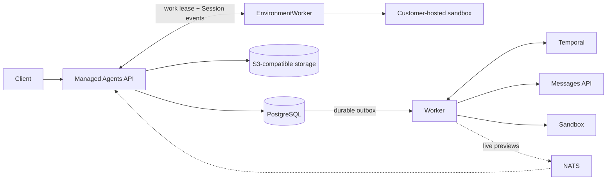

<p align="center">
  <picture>
    <source media="(prefers-color-scheme: dark)" srcset="assets/mango-logo-dark.svg">
    <source media="(prefers-color-scheme: light)" srcset="assets/mango-logo.svg">
    
  </picture>
</p>

<p align="center">
  <strong>The independent, open-source runtime for Claude Managed Agents.</strong>
</p>

<p align="center">
  <a href="https://yanpgwang.github.io/mango/">Documentation</a> ·
  <a href="https://yanpgwang.github.io/mango/getting-started">Getting started</a> ·
  <a href="https://yanpgwang.github.io/mango/compatibility">Compatibility</a> ·
  <a href="https://yanpgwang.github.io/mango/architecture">Architecture</a> ·
  <a href="https://platform.claude.com/docs/en/managed-agents/overview">Claude Managed Agents</a>
</p>

<p align="center">
  <a href="https://github.com/yanpgwang/mango/actions/workflows/ci.yml"></a>
  <a href="https://github.com/yanpgwang/mango/actions/workflows/pages.yml"></a>
  <a href="LICENSE"></a>
</p>

Mango implements the documented Managed Agents API as a self-hosted runtime:
durable sessions, event streaming, tool orchestration, File and custom Skill
resources, persistent Memory Stores, an encrypted Vault control plane, durable
scheduled Deployments, self-hosted Environment worker leases, and pluggable
sandbox execution. Its
production-oriented architecture is built in Go on PostgreSQL and Temporal.

## Why Mango

- **Own the runtime.** Use the supported Anthropic wire contract through raw
  HTTP or the official Go SDK while keeping state and execution on your
  infrastructure.
- **Keep accepted work durable.** Sessions, events, interrupts, tool calls, and
  client-action waits survive API and worker restarts.
- **Bring your own execution environment.** Choose local, Docker, E2B,
  CubeSandbox, OpenSandbox, or Daytona sandbox adapters.
- **Run the whole stack locally.** Start without external model credentials;
  the Compose stack supplies a development-only Mango API key.
- **Inspect every turn.** Query the persisted event history, stream live
  previews over SSE, and inspect active workflows in Temporal UI.

## Quick start

You need Docker with Compose and `make`.

```bash
git clone https://github.com/yanpgwang/mango.git
cd mango
make local-up
make local-health
```

Verify that Mango is ready:

```bash
curl -i http://localhost:8080/readyz
```

The local stack uses a deterministic offline model, so no model API key is
required. Protected Mango routes use the development key
`sk-mango-local-development`; health and readiness remain public.
Follow the [five-minute walkthrough](https://yanpgwang.github.io/mango/getting-started)
to create an Environment, Agent, and Session, then send and stream your first
message.

```bash
make local-down
```

## API compatibility

> [!IMPORTANT]
> Mango is in alpha. It exposes the 90 operations in its pinned Managed Agents
> contract, with capability-specific limitations, and is not an Anthropic
> product or a drop-in replacement for every hosted behavior. The official Go
> SDK is pinned at v1.63.1; its five separate Dreams research-preview operations
> are not part of Mango's current HTTP surface.
> Its architecture is designed for production operation, but the project does
> not yet claim production readiness.
> Review the [compatibility matrix](https://yanpgwang.github.io/mango/compatibility)
> before relying on a capability. The default local sandbox is for development
> and is not a security boundary.

| Area | Current support |
| --- | --- |
| Core resources | Agent, Environment, and Session lifecycle, versioning, filtering, and pagination |
| Events and runtime | Messages, interrupts, custom-tool results, confirmations, outcomes, retries, SSE, and durable park/resume |
| Tools | Sandbox built-ins, provider-native Web Search/Fetch, and remote MCP tools with optional Vault-backed bearer authentication |
| Files | Five-operation Files API with configured object storage; File-backed Session Resources and idle-boundary publication of Docker `/mnt/session/outputs` deliverables |
| Skills | Nine custom resource operations, immutable Version pins, and Claude Code-style on-demand instruction loading in Docker Sessions |
| Memory | Fourteen Store, Memory, and immutable Version operations; durable read/write or read-only Docker mounts at `/mnt/memory` |
| Vaults | Thirteen encrypted Vault and Credential operations plus ordered Session attachment, live OAuth validation, and automatic token refresh; environment-variable egress remains in progress |
| Deployments | Ten Deployment and Deployment Run operations, pinned Agent versions, manual runs, and PostgreSQL-leased cron scheduling |
| Environment Work | Eight worker-protocol operations, transactional self-hosted Session activation, lease heartbeats, reclaim, and official Go `WorkPoller` interoperability |
| Session Threads | Persistent coordinator delegation plus Mango-managed Advisor consultations over ordinary client tool calls, with independent context, usage, lifecycle events, reports, isolated event/preview streams, routed client-action waits, and durable interrupts |
| Sandboxes | Local and Docker available; E2B, CubeSandbox, OpenSandbox, and Daytona in Preview |

The [compatibility summary](https://yanpgwang.github.io/mango/compatibility)
states the user-visible boundary. Persistent child-Agent orchestration,
provider-neutral Advisor consultations, and shared Session budgets are
implemented; Dreams, environment-variable secret egress, and
production-platform hardening remain explicit compatibility gaps or focused
[GitHub Issues](https://github.com/yanpgwang/mango/issues).

## Architecture



PostgreSQL owns public state, event history, Memory contents and Versions, and
File/Skill lifecycle intents.
An S3-compatible store owns File bytes and immutable Skill archives. Temporal
owns in-flight execution. NATS
carries only ephemeral wakeups and previews; persisted events are always
reconciled from PostgreSQL. A lost signal, process restart, or NATS outage
cannot discard accepted work.

Read the [architecture overview](https://yanpgwang.github.io/mango/architecture)
for the failure model, transactional outbox, tool journal, interrupt ordering,
and sandbox lifecycle.

## Documentation

| I want to… | Read |
| --- | --- |
| Run my first agent session | [Getting started](https://yanpgwang.github.io/mango/getting-started) |
| Connect a real model endpoint | [Use a real model endpoint](https://yanpgwang.github.io/mango/getting-started#use-a-real-model-endpoint) |
| Choose an execution backend | [Sandbox backends](https://yanpgwang.github.io/mango/sandboxes) |
| Run a coordinator and child Agents | [Multi-agent guide](https://yanpgwang.github.io/mango/guides/multi-agent) |
| Check an API operation | [API reference](https://yanpgwang.github.io/mango/api) |
| Understand supported behavior | [API compatibility](https://yanpgwang.github.io/mango/compatibility) |
| Plan a deployment | [Deployment model](https://yanpgwang.github.io/mango/deployment) |

The complete documentation is also published at
[yanpgwang.github.io/mango](https://yanpgwang.github.io/mango/).

## Development

```bash
make verify       # lint, unit tests, race tests, and vet
make docs-check   # type-check and build the documentation site
make image-smoke  # build and smoke-test the container image
```

Default tests are offline. PostgreSQL, Temporal, NATS, MinIO, Docker, model,
and remote-sandbox integrations have explicit opt-in suites. See the
[local stack guide](deployments/local/README.md) and
[contribution guide](CONTRIBUTING.md).

Report vulnerabilities privately as described in [SECURITY.md](SECURITY.md).

## License

Mango is licensed under the [Apache License 2.0](LICENSE).
