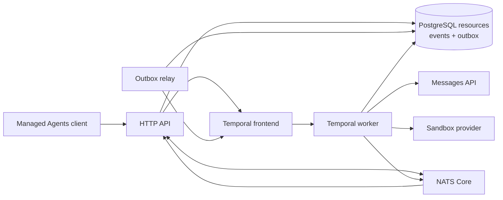

# Architecture overview

`managed-agent-go` is one codebase with explicit API and worker process roles.
PostgreSQL owns public resources and events, Temporal owns in-flight
orchestration, and NATS Core carries ephemeral wakeups and previews. The local
Compose stack runs those roles separately; they can also be packaged in one
deployment for development.

The selected stack is Temporal orchestration, PostgreSQL, NATS Core, and
replaceable sandbox providers. Object storage and provider-backed sandbox
leases are not implemented.

## Design principles

### The server owns history

The event log is the source of truth for a session, but two different orderings
are read from it:

- **Public event history** (`GET .../events`, list, and the live SSE stream) is
  the immutable receipt/commit sequence. It never reorders or hides events.
- **Model-facing conversation order** is reconstructed per turn from causality,
  not from raw commit order. PostgreSQL tags committed output with the trigger
  event ID; prior processed triggers are replayed with their exact output before
  the current trigger. A turn never sees a later message queued while it was
  still running.

Before each model turn the application reconstructs that causal history and
projects it into a Messages API conversation. The model endpoint performs
inference; it does not own session state.

### Wire and domain models are separate

`internal/httpapi` owns request decoding and response encoding.
`internal/domain` models persisted resources and execution facts. Mapping is
explicit in both directions so internal sequence numbers, run states, and
storage details cannot leak into the compatibility wire.

### Public history and execution bookkeeping are different things

Session events are the public append-only history. Temporal Workflow history,
turn attempts, and tool steps are private execution facts. Keeping those models
separate lets orchestration recover without leaking Temporal or retry details
onto the public API.

### Interfaces sit at expensive boundaries

The model client, agent runtime, and sandbox provider are interfaces because
they cross process, trust, or infrastructure boundaries. Domain entities stay
concrete. This keeps the code easy to follow without locking the project to one
model vendor, sandbox backend, or worker topology.

## Package boundaries

| Package | Responsibility |
| --- | --- |
| `cmd/managed-agent` | Composition root, configuration, process lifecycle |
| `internal/httpapi` | HTTP routes, strict validation, DTO mapping, SSE |
| `internal/app` | Shared resource validation and legacy compatibility services |
| `internal/controlplane` | PostgreSQL-backed public Session/Event use cases |
| `internal/domain` | Resource, event, message, tool, and run semantics |
| `internal/pg` | PostgreSQL repositories, ledger, outbox, and tool journal |
| `internal/temporal` | Session Workflow, Activities, worker, and relay |
| `internal/live` | NATS wakeups/previews plus PostgreSQL cursor reconciliation |
| `internal/store` | Deprecated SQLite compatibility implementation |
| `internal/agentruntime` | Model/tool orchestration behind `AgentRuntime` |
| `internal/model` | Offline and Messages API model clients |
| `internal/sandbox` | Local and Docker execution providers |

The dependency direction points inward: transport and infrastructure depend on
application/domain semantics, while the domain has no HTTP, SQL, model-client,
or sandbox dependencies.

## Durable write path

Submitting input is not “write an event, then call Temporal.” PostgreSQL commits
the client events, `session.status_running`, Session projection, and one
coalescible outbox wakeup in one transaction. A crash therefore cannot leave
accepted input without a durable path to orchestration. A direct
Signal-With-Start is only a latency optimization; the relay is the correctness
path.

Model and tool calls happen as Temporal Activities outside SQL transactions. At
turn completion, authoritative output, trigger `processed_at`, the final Session
status, and optional attempt finalization commit together. PostgreSQL then emits
a best-effort NATS wakeup; SSE subscribers read the committed rows by sequence.

Physical session deletion is a small saga: PostgreSQL first marks the row as
deleting under the admission lock, the API terminates its Temporal Workflow,
then PostgreSQL removes the projection. The marker blocks concurrent admission
and remains on an ambiguous termination error so a repeated DELETE can safely
finish instead of leaving a `running` projection without a Workflow.

Live text deltas are the exception: they are explicitly ephemeral previews,
delivered only to opted-in SSE subscribers. They are never returned by event
history.

## Scaling boundaries

API replicas are stateless around PostgreSQL and NATS. Temporal assigns Workflow
and Activity tasks to workers; the PostgreSQL tool journal records the
side-effect ambiguity boundary. Core NATS is at-most-once, so streams
periodically reconcile their durable cursor and never treat a wakeup as data.
Worker Versioning and provider-backed sandbox leases are still required before
production rolling deployments.

## Current implementation boundaries

The strongest current risks are semantic rather than structural:

1. PostgreSQL now owns the pending-action rows, atomic park transaction,
   resolution claim, and admission gate. The primary Workflow still has to
   replace its client-action rejection with a durable park/resume selector
   before the legacy dispatcher can be removed.
2. `user.interrupt` still lacks the cross-process durable cancellation and
   finish-vs-interrupt ordering contract on the primary path.
3. Sandboxes are session-scoped: a session's logical sandbox is provisioned on
   first tool use, reused across its runs, and released on session deletion.
   The manager is in-memory, so a process restart does not restore an idle
   session's workspace, and there is no durable checkpoint, quota, or eviction
   policy yet.
4. Worker Versioning, observability, authentication, large-payload offload, and
   production manifests remain open.

Current API support is tracked in the [compatibility matrix](compatibility.md);
planned capability work is kept in the [roadmap](roadmap.md).
