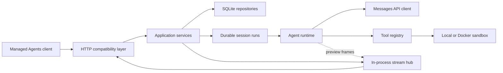

# Architecture overview

`managed-agent-go` is a modular monolith: one Go process hosts the compatible
HTTP API, durable control plane, run dispatcher, agent runtime, and sandbox
provider. SQLite is the durable store. These are current deployment choices,
not permanent topology constraints.

## Design principles

### The server owns history

The event log is the source of truth for a session, but two different orderings
are read from it:

- **Public event history** (`GET .../events`, list, and the live SSE stream) is
  the immutable receipt/commit sequence. It never reorders or hides events.
- **Model-facing conversation order** is reconstructed per turn from run
  causality, not from raw commit order. For each prior completed run, in
  admission order, the projection replays that run's trigger event IDs followed
  by its persisted output event IDs, then appends the current run's trigger. The
  output association is durable state on the run, so this ordering is rebuilt
  identically after a restart, and a run never sees a later trigger that was
  queued while it was still running.

Before each model turn the application reconstructs that causal history and
projects it into a Messages API conversation. The model endpoint performs
inference; it does not own session state.

### Wire and domain models are separate

`internal/httpapi` owns request decoding and response encoding.
`internal/domain` models persisted resources and execution facts. Mapping is
explicit in both directions so internal sequence numbers, run states, and
storage details cannot leak into the compatibility wire.

### Public history and execution bookkeeping are different things

Session events are the public append-only history. Session runs are private,
durable work items with `queued`, `running`, `completed`, and `failed` states.
Keeping these models separate allows the executor to recover and eventually
retry work without changing the public API.

### Interfaces sit at expensive boundaries

The model client, agent runtime, and sandbox provider are interfaces because
they cross process, trust, or infrastructure boundaries. Domain entities stay
concrete. This keeps the code easy to follow without locking the project to one
model vendor, sandbox backend, or worker topology.

## Package boundaries

| Package | Responsibility |
| --- | --- |
| `cmd/managed-agent` | Composition root, configuration, process lifecycle |
| `internal/httpapi` | HTTP routes, strict validation, DTO mapping, SSE |
| `internal/app` | Use cases, admission, run dispatch, event publication |
| `internal/domain` | Resource, event, message, tool, and run semantics |
| `internal/store` | SQLite repositories and atomic state transitions |
| `internal/agentruntime` | Model/tool orchestration behind `AgentRuntime` |
| `internal/model` | Offline and Messages API model clients |
| `internal/sandbox` | Local and Docker execution providers |

The dependency direction points inward: transport and infrastructure depend on
application/domain semantics, while the domain has no HTTP, SQL, model-client,
or sandbox dependencies.

## Durable write path

Submitting input is not “write an event, then enqueue work.” The store commits
the client events, `session.status_running`, session projection, and one queued
run per processable trigger (in admission order) in one transaction. A crash
therefore cannot leave accepted input without corresponding work.

Runtime calls happen outside SQL transactions. At run completion, buffered
authoritative output, trigger `processed_at`, the final session status, and run
completion are committed together. Persisted events are published to the
in-process stream hub only after the commit succeeds.

Live text deltas are the exception: they are explicitly ephemeral previews,
delivered only to opted-in SSE subscribers. They are never returned by event
history.

## Scaling boundaries

The current process uses an in-memory stream hub and goroutines to drain durable
runs. The durable queue and package boundaries make an API/worker split
possible, but multi-process execution still requires:

- database migrations and a production database implementation;
- leases, fencing tokens, and attempt records;
- durable or replayable runtime progress;
- an outbox or equivalent post-commit delivery mechanism;
- side-effect idempotency and a clear retry policy;
- a distributed stream fan-out layer.

Adding worker replicas before those invariants exist would create ambiguous
ownership and duplicate-side-effect risks.

## Known architectural debt

The strongest current risks are semantic rather than structural:

1. Runtime output is buffered until completion even though tools may already
   have performed side effects. A process crash can therefore repeat a side
   effect without a durable journal of the prior attempt.
2. Pending client actions are now a first-class durable `pending_actions` model
   with a claim gate: a parked run persists one pending action per action event
   (kind derived from the committed event's type AND payload) in the same transaction as the
   action events, the `requires_action` terminal, the session projection, and
   the run completion. While unresolved, ordinary queued runs — including runs
   admitted before the park — are not claimable, and work admitted while the gate
   is closed stays queued with the session left idle (no `session.status_running`);
   only a matching resolution
   trigger bypasses them, and the gate clears atomically when the resume run
   closes. Admission rejects unknown, already-resolved, duplicate, wrong-session,
   and wrong-kind references. The single custom-tool park/resume cycle is proven
   end to end and survives restart. Remaining gaps: the `always_ask`
   `user.tool_confirmation` allow/deny **execution** resume is not implemented,
   and a park with multiple action events gates all of them but has no
   aggregated multi-action resume protocol (each must be resolved individually).
3. Sandboxes are session-scoped: a session's logical sandbox is provisioned on
   first tool use, reused across its runs, and released on session deletion.
   The manager is in-memory, so a process restart does not restore an idle
   session's workspace, and there is no durable checkpoint, quota, or eviction
   policy yet.
4. `SessionService` currently combines session CRUD, admission, dispatch, and
   completion orchestration. These responsibilities should be separated before
   introducing multiple workers or richer retry behavior.

These are tracked in the [roadmap](roadmap.md). The current architecture is a
good foundation for an OSS alpha, but the above invariants should be resolved
before presenting it as production-ready.
