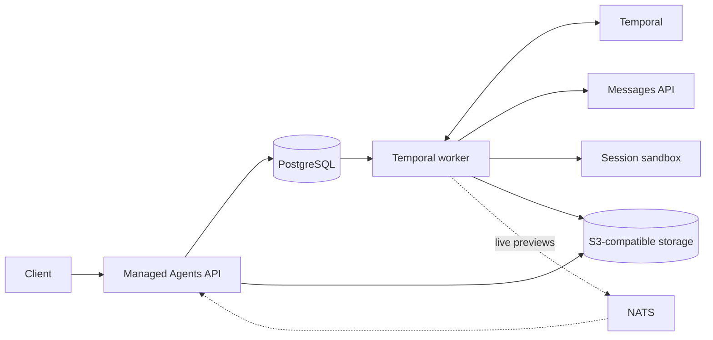

Mango separates durable session state from model inference and tool execution.
That keeps a worker restart, sandbox reconnect, or dropped live signal from
discarding accepted work.

## The short version

| Component | Responsibility |
| --- | --- |
| PostgreSQL | Source of truth for resources, accepted input, event history, tool state, and File/Skill lifecycle intents |
| S3-compatible storage | Owns File bytes and immutable custom Skill archives |
| Temporal | Resumes in-flight turns and waits after worker or provider failures |
| Sandbox provider | Owns the replaceable, session-scoped workspace where tools run |
| NATS | Carries low-latency wakeups and live previews; it is never the source of truth |
| Messages API | Performs inference; it does not own the Session or its durable history |

An API request first commits accepted input to PostgreSQL. Temporal then runs
the model/tool loop until the Session becomes idle or waits for a custom tool,
confirmation, or self-hosted result. Final events are persisted. SSE clients
can also opt into ephemeral text previews while a model call is running.

## Properties that matter

- **Accepted means durable.** A process crash after acceptance does not orphan
  the turn.
- **One ordered history.** Persisted Session events remain authoritative even
  if a live notification is lost.
- **Side effects are journaled.** Retries do not silently pretend an ambiguous
  tool call never happened.
- **Sandboxes can reconnect.** Their provider and external ID are persisted per
  Session so a worker can attach after restart.

<Warning>
  These are runtime design goals, not a production security or availability
  certification. Mango is still missing authentication, tenant isolation,
  production rollout tooling, and audited sandbox guarantees.
</Warning>

## Design references

Two public engineering articles are especially important to Mango's design:

- Anthropic's
  [Scaling Managed Agents: Decoupling the brain from the hands](https://www.anthropic.com/engineering/managed-agents)
  describes separating the agent harness, durable session log, model, and
  sandbox so long-running work can recover.
- Cursor's
  [What we've learned building cloud agents](https://cursor.com/blog/cloud-agent-lessons)
  argues that the development environment is part of the product and that
  agent-loop, machine, and conversation state need durable, decoupled
  execution.

They are meaningful independent validation of the problem framing and the
direction Mango takes with PostgreSQL, Temporal, and replaceable sandboxes.
They are references—not endorsements of Mango, affiliation claims, or evidence
of API compatibility.
