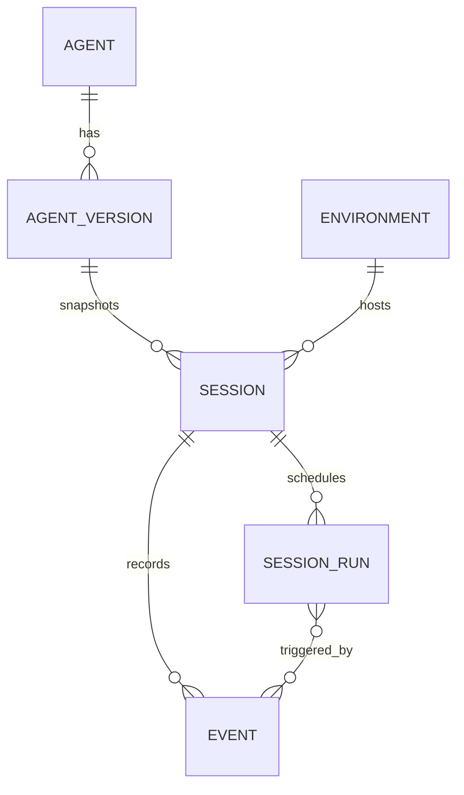

# Domain model

The public API is resource-oriented, while execution uses an additional
internal run model. That distinction is central to the architecture.



## Agent and agent version

An agent defines model configuration, system prompt, tools, MCP server
references, skills, metadata, and optional multiagent configuration.

The logical identity is the agent `id`; each material update produces a new
integer `version`. A conditional update may send the expected `version` to
detect concurrent changes. Archiving is idempotent, creates no new version, and
makes the agent read-only.

## Environment

An environment is a named configuration record selected when creating a
session. The current `cloud` record routes to the Temporal worker and its
configured sandbox provider. `self_hosted` records can be stored but sessions
against them are explicitly unsupported.

An environment cannot be deleted while a session references it. Archiving
prevents it from being selected by new sessions without invalidating existing
references.

## Session

A session is the long-lived public container for conversation and execution
state. At creation, it resolves:

1. the latest or explicitly pinned agent version;
2. optional session-local overrides;
3. the selected environment.

The resulting agent snapshot is stored with the session. Later agent updates or
archival cannot mutate it.

The public session status is a projection:

- `idle` — waiting for input or a required client action;
- `running` — accepted work is executing or queued;
- `rescheduling` — reserved for automatic retry behavior;
- `terminated` — terminal failure or completion.

Temporal may retry failed Activities internally without changing the public
status. The public `rescheduling` transition is not implemented; an exhausted
or terminal turn failure projects directly to `terminated`.

## Event

Events are the public, append-only session history. On the wire each event is a
flat tagged union:

```json
{
  "id": "sevt_...",
  "type": "user.message",
  "content": [{"type": "text", "text": "hello"}],
  "processed_at": null
}
```

Internally, each event also has a session-local sequence number used for stable
ordering and cursors. That sequence is never exposed.

Client input, agent output, status changes, errors, and session updates all use
the same log. This gives clients one replayable history rather than separate
message, tool-call, and execution-status stores.

## Workflow turn

A Workflow turn is internal execution bookkeeping, not a public Managed Agents
resource. PostgreSQL records the trigger and committed output; Temporal records
the durable orchestration history and Activity results.

```text
admitted → executing → completed
                     ↘ failed
```

The admission outbox lets accepted input survive API, relay, and worker
restarts. Temporal resumes the Workflow from recorded Activity results.
PostgreSQL turn attempts and tool steps journal the external-side-effect
ambiguity boundary.

## Why events are not runs

Events describe observable session history; Workflow and Activity attempts
describe how the server tries to produce that history. Retries therefore remain
private and do not become public API events.
