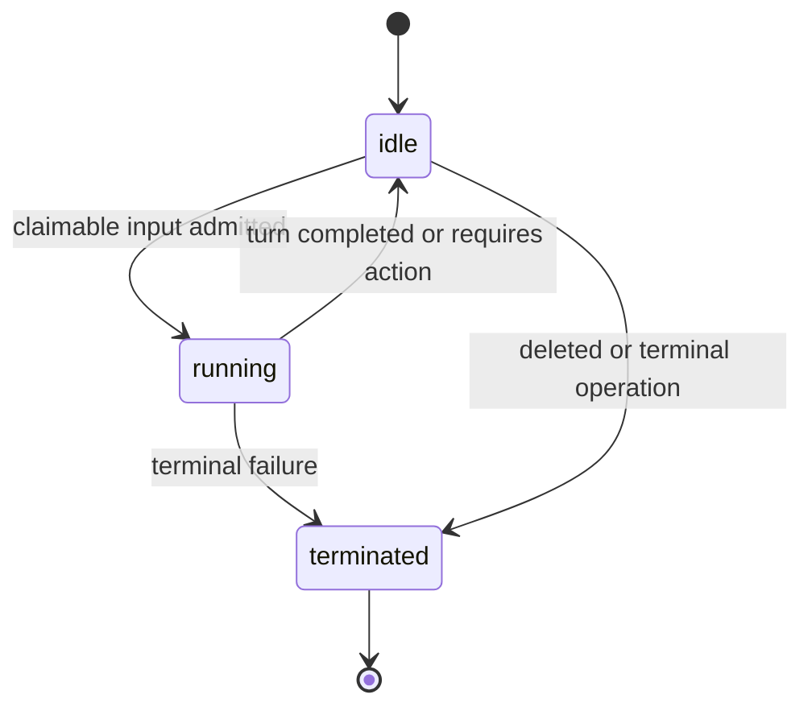

# Session lifecycle

A Session is a durable conversation and execution boundary. PostgreSQL owns its
public state and event history; one Temporal Workflow serializes its in-flight
work.

## Public states

- `idle` means the Session is waiting for ordinary input or a required client
  action.
- `running` means accepted, claimable work is queued or executing.
- `rescheduling` is reserved for a future public retry policy. Temporal
  Activity retries remain private and do not use it.
- `terminated` is final.

The status is a projection of committed events. It is not derived from worker
memory or a Temporal query.

## Admission

The API commits client input, its session-local receipt sequence, any required
status transition, and a coalescible orchestration outbox wakeup in one
PostgreSQL transaction. A direct Temporal signal is a latency optimization; the
outbox relay is the recovery path.

Accepted input therefore survives an API or worker crash. NATS is never used as
an execution queue.

## Turn execution

One Workflow ID is derived from each Session ID. The Workflow:

1. loads the next claimable trigger from PostgreSQL;
2. reconstructs model-facing history from committed causal history;
3. calls the model and tools through Temporal Activities;
4. commits authoritative output, trigger processing, attempt finalization, and
   the final Session state in one PostgreSQL transaction;
5. advances to the next trigger only after that commit.

Different Sessions can execute concurrently. Work within one Session remains
serialized.

## Event order and conversation order

The event ledger has two consumers with different ordering needs:

- The public API and SSE stream expose immutable receipt order.
- Model requests use causal conversation order: each processed user trigger is
  followed by the output committed for that turn before a later trigger is
  projected.

This prevents a message admitted during an active turn from appearing in the
model conversation before the reply to the earlier message.

## Tool loop

The Workflow invokes one Activity per model call and built-in tool call.
Completed Activity results are recorded in Temporal history. PostgreSQL also
journals tool steps across `prepared`, `started`, and `completed` so recovery
does not silently repeat a side effect whose result was lost.

A recovered `started` step without a durable result is classified as ambiguous
and refused. Exactly-once execution still requires idempotency from the
side-effecting system.

## Required client actions

A custom tool call or an `always_ask` built-in can end a turn with
`session.status_idle` and `stop_reason.type=requires_action`. The stop reason
contains the action event IDs the client must answer.

PostgreSQL persists those blockers in the same transaction as the action events
and idle status. While any blocker remains unresolved:

- ordinary input is accepted and ordered but is not claimable;
- the Session remains `idle`;
- ordinary input does not enqueue an orchestration wakeup;
- only a matching `user.custom_tool_result` or
  `user.tool_confirmation` can claim the blocker;
- partial results leave the Session idle and do not wake orchestration;
- the final result transitions the Session to running and wakes orchestration;
- resume completion resolves the complete barrier atomically before ordinary
  queued work can continue.

The versioned Workflow selector reads this barrier through an Activity before
ordinary receipt-order work. Once fully claimed, it reconstructs the original
parked tool-use round and all client results, resumes the model loop, and leaves
the receipt cursor behind any lower-sequence ordinary messages admitted during
the wait. A resumed model turn may atomically replace the old barrier with a new
one.

## Failure and delivery semantics

- Permanent model failures commit `session.error` and
  `session.status_terminated`.
- Retryable model and infrastructure failures remain Activity failures so
  Temporal can apply its retry policy.
- Authoritative output is visible only after the PostgreSQL completion
  transaction commits.
- NATS previews and wakeups are best-effort. Clients recover complete events
  from the PostgreSQL-backed event cursor.
- Workflow and Activity retries are private implementation details and never
  create duplicate public events.

## Session deletion

Deletion first fences the Session against new admission, then terminates its
Workflow, then removes the PostgreSQL projection. Repeating deletion can finish
an interrupted attempt safely.

The sandbox is released as part of Session teardown. Current local and Docker
sandbox identity is process-local, so restart continuity is not yet provided.
