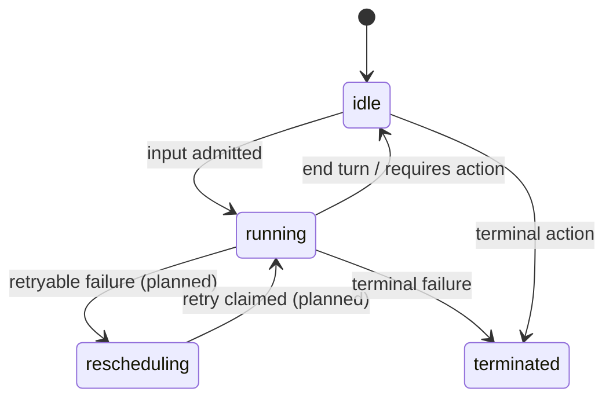
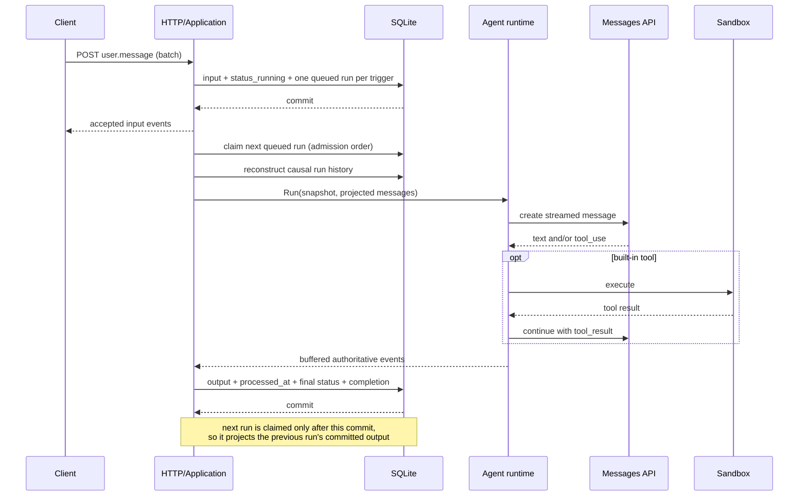

# Session lifecycle

## State transitions

`rescheduling` is part of the public status model but is not currently emitted:
the implementation has no automatic retry policy and avoids promising one.

## Input-to-output sequence

## Admission invariant

The server commits all of the following atomically, in submitted input order:

- submitted client events;
- a `session.status_running` event when the session was not already running;
- the mutable session status;
- one queued internal run **per processable trigger event**, in admission
  order. A run references exactly one trigger; multiple triggers are never
  grouped into a single run.

The client is never told that input was accepted unless the corresponding work
item is durable.

When an admitted event is a resolution (`user.custom_tool_result` /
`user.tool_confirmation`), the same admission transaction validates it against an
open pending action and records the resolving event id, so a bad reference fails
atomically before any run is enqueued.

## Two orderings of the event log

The event log is read in two distinct orders:

- **Public event history** — `GET .../events`, list, and the live SSE stream —
  is the immutable receipt/commit sequence. It is never reordered.
- **Model-facing conversation order** is reconstructed per turn from run
  causality. For each prior completed (or failed) run, in admission order, the
  projection replays that run's trigger event IDs followed by its persisted
  output event IDs, then appends the current run's trigger. The run's output
  event IDs are durable state committed in the same transaction that closes the
  run, so this ordering survives a restart and a run never sees a later trigger
  queued while it was still running. Tested by
  `TestRunStore_ModelHistorySurvivesReopenInCausalOrder` (file-backed reopen)
  and `TestSessionService_BatchedTriplePerRunCausalProjection` (three batched
  triggers project as three causal turns).

## Per-run boundary

Runs drain one at a time in admission order. A run commits its buffered
authoritative output and stamps its trigger processed *before* the next run is
claimed, so each run's causal history already includes the previous run's
committed output — a later user event in the same batch sees the earlier agent
reply (`TestRunStore_CompletionBeforeNextClaimObservesOutput`,
`TestSessionService_SecondUserEventObservesFirstAgentOutput`). A terminated
session is final: its leftover queued runs are never claimed, and it is never
flipped back to `running`.

## Per-session ordering

A partial unique database index permits at most one `running` item per session.
Additional input can be committed while a run executes, but it becomes later
queued work. Different sessions may run concurrently.

The process also uses sharded in-memory locks to serialize short state-changing
operations. Runtime and sandbox work happens outside both those locks and SQL
transactions.

## Completion invariant

On success or failure, one transaction:

- appends buffered authoritative runtime events;
- stamps the run's trigger events as processed;
- updates the session projection;
- marks the run completed or failed.

Events are published to active SSE subscribers only after the commit.

## Restart recovery

At startup, interrupted `running` runs are returned to `queued` and drained
again. This prevents silent loss, but it is at-least-once execution. A crash
after a tool side effect and before completion commit can repeat that side
effect.

Production-grade retries therefore require an attempt model, durable tool
journal, and idempotency contract before multiple workers are introduced.

## Client-required actions

A custom tool or `always_ask` built-in can park a run:

1. the runtime emits `agent.custom_tool_use` or `agent.tool_use`;
2. the session returns to `idle` with `stop_reason.type=requires_action`;
3. the stop reason names the event IDs the client must answer;
4. the park persists a first-class durable **pending action** per named action
   event, in the *same transaction* that commits the action events, the
   terminal `session.status_idle{requires_action}`, the session projection, and
   the run completion.

A pending action is internal-only durable state (never on the public wire). It
records the session id, the blocking action event id, and the expected response
kind. The kind is **derived from the committed action event's type AND payload**
(`agent.custom_tool_use` → `custom_tool_result`; `agent.tool_use` →
`tool_confirmation`, but only when its `evaluated_permission` is `"ask"`) — never
trusted from a caller string.

### Pending-action claim gate

While a session has any unresolved pending action, its ordinary queued runs are
**not claimable**, even runs that were admitted before the run parked. Only a run
whose trigger is the matching resolution may bypass those earlier queued runs.
Work admitted while the gate is closed — an ordinary `user.message` that is not
the matching resolution — is durably queued but leaves the session **idle** and
emits no `session.status_running`, since that run cannot yet be claimed. The gate
clears when the resume run closes, in the same transaction that resolves the
pending action, so previously-blocked queued work continues only after the resume
commit. (A terminally *failed* resume also closes the run and marks the action
resolved — the park is answered honestly — but a terminated session is never
resurrected.) At most one run per session is ever running, and selection stays
deterministic within whichever set (resume-only, or ordinary) is claimable.

### Admission validation

`user.custom_tool_result` and `user.tool_confirmation` must reference a currently
open pending action of the matching kind. Unknown, already-resolved, duplicate,
wrong-session, and wrong-kind references fail atomically at admission (validation
or conflict errors under the existing HTTP conventions) and create no runnable
work.

### Proven behavior and limitation

The single custom-tool cycle is implemented and tested end to end: park →
durable pending action → matching `user.custom_tool_result` → resume run →
`end_turn`, with the gate clearing atomically so prior ordinary queued work
continues only after the resume closes. Restart recovery retains the gate: a
file-backed close/reopen keeps the pending action, an earlier queued run stays
gated, and a later matching result still resumes. Session deletion removes
pending-action rows with the session.

The single built-in `user.tool_confirmation` **execution** resume is now
implemented and tested end to end for both decisions:

- The confirmation trigger drives a fresh run. The app recovers the **original**
  committed `agent.tool_use` from server-owned causal history by the id in
  `tool_use_id` (never from any client-supplied name/input) and passes it to the
  runtime. Only a persisted `agent.tool_use` whose `evaluated_permission` is
  `"ask"` — one that already passed the durable pending-action admission gate —
  can resume; the runtime re-validates that the recovered event is an ask-policy
  `agent.tool_use`, that its tool is a registered built-in, and that the built-in
  is enabled in the session's toolset.
- **Allow**: the runtime executes the original built-in once per successful run
  attempt through the existing `tools.Registry`/`Sandbox` path (a crash between
  execution and the completion commit can replay it — see below), emits
  `agent.tool_result` with
  `tool_use_id` equal to the original committed action event id and the actual
  content/`is_error`, threads the paired `tool_use`/`tool_result` into the model
  conversation, and continues the bounded model loop to `end_turn`.
- **Deny**: the sandbox/executor is never invoked; the runtime emits an
  `agent.tool_result` correlated to the original id marked `is_error`, with the
  `deny_message` preserved in the delivered text, then continues the loop so the
  model can react.
- A malformed or unresolvable confirmation (missing/unknown original action,
  non-`ask`, non-built-in, or disabled built-in) fails the run safely and
  executes nothing. Because the paired result answers the previously parked
  `agent.tool_use`, the two re-project as a valid `tool_use`/`tool_result` pair
  (`TestProjectMessages_ConfirmationToolResultPairing`); before execution the
  dangling `tool_use` is still dropped so no malformed request reaches the model.

Two limitations remain explicit. The project has **no durable side-effect
journal**: an allowed built-in runs before its `agent.tool_result` and the run
completion commit, so a crash between execution and commit can **replay the side
effect** on restart recovery. No retry/idempotency subsystem is added here. And
the exact official **result wording and wire shape** of the rejection
`agent.tool_result` (and of the `requires_action` payload) remain unconfirmed
against the stable Managed Agents service; only single-action behavior is
claimed.

A run that parks with **multiple** action event IDs persists and gates *all* of
them, but there is **no aggregated multi-action resume protocol** in this
milestone. Each pending action must be resolved individually; the gate stays
closed until every one is resolved. This limitation is explicit and tested at the
store/gate level (`TestPending_MultiActionParkGatesAllButNoAggregateResume`); the
single-action flow is not regressed.
