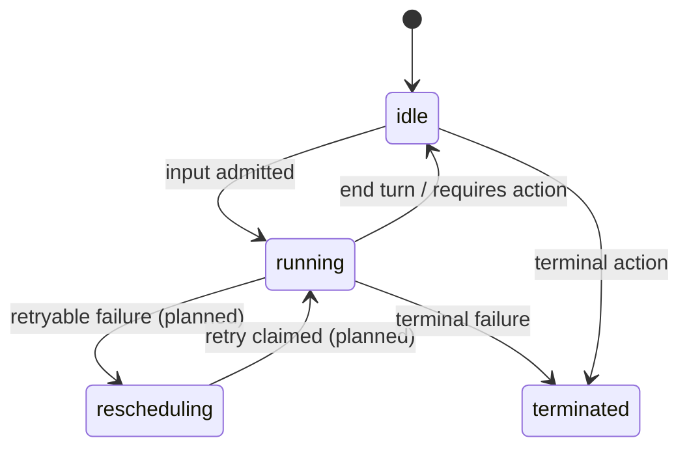
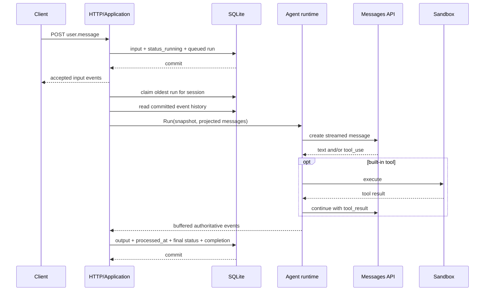

# Session lifecycle

## State transitions

`rescheduling` is part of the public status model but is not currently emitted:
the implementation has no automatic retry policy and avoids promising one.

## Input-to-output sequence

## Admission invariant

The server commits all of the following atomically:

- submitted client events;
- a `session.status_running` event when the session was not already running;
- the mutable session status;
- one queued internal run referencing the submitted event IDs.

The client is never told that input was accepted unless the corresponding work
item is durable.

## Per-session ordering

A partial unique database index permits at most one `running` item per session.
Additional input can be committed while a run executes, but it becomes later
queued work. Different sessions may run concurrently.

The process also uses sharded in-memory locks to serialize short state-changing
operations. Runtime and sandbox work happens outside both those locks and SQL
transactions.

## Completion invariant

On success or failure, one transaction:

- appends buffered authoritative runtime events;
- stamps the run's trigger events as processed;
- updates the session projection;
- marks the run completed or failed.

Events are published to active SSE subscribers only after the commit.

## Restart recovery

At startup, interrupted `running` runs are returned to `queued` and drained
again. This prevents silent loss, but it is at-least-once execution. A crash
after a tool side effect and before completion commit can repeat that side
effect.

Production-grade retries therefore require an attempt model, durable tool
journal, and idempotency contract before multiple workers are introduced.

## Client-required actions

A custom tool or `always_ask` built-in can park a run:

1. the runtime emits `agent.custom_tool_use` or `agent.tool_use`;
2. the session returns to `idle` with `stop_reason.type=requires_action`;
3. the stop reason names the event IDs the client must answer;
4. a custom tool response starts a new durable run.

Custom-tool resume is implemented. Built-in `user.tool_confirmation` is
accepted by the HTTP API, but its allow/deny resume semantics are not complete.
