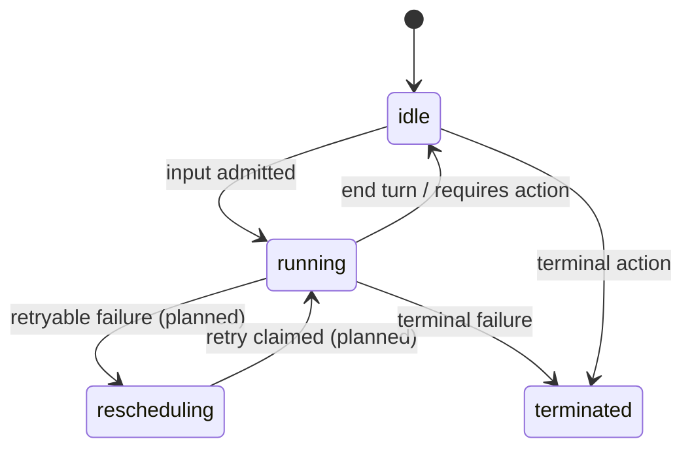
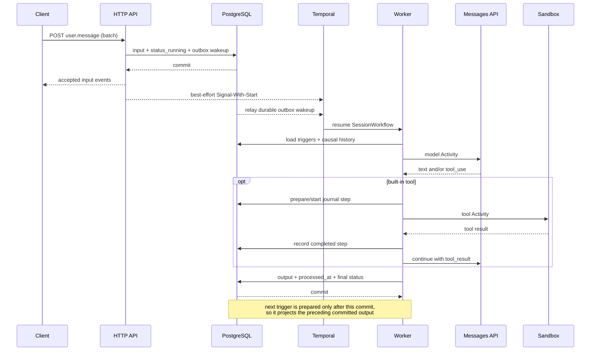

# Session lifecycle

## State transitions

`rescheduling` is part of the public status model but is not currently emitted:
Temporal Activity retries remain internal and do not promise a public
rescheduling policy.

## Input-to-output sequence

## Admission invariant

The server commits all of the following atomically, in submitted input order:

- submitted client events;
- a `session.status_running` event when the session was not already running;
- the mutable session status;
- one coalescible orchestration outbox wakeup carrying the highest committed
  receipt sequence.

The client is never told that input was accepted unless PostgreSQL has a durable
path to execution. A direct Temporal signal is a latency optimization; the
outbox relay is the correctness path.

## Two orderings of the event log

The event log is read in two distinct orders:

- **Public event history** — `GET .../events`, list, and the live SSE stream —
  is the immutable receipt/commit sequence. It is never reordered.
- **Model-facing conversation order** is reconstructed per turn from trigger
  causality. Each prior processed `user.message` is replayed immediately before
  its committed output (correlated by `turn_event_id`), followed by the current
  trigger. This ordering survives worker restart and prevents a later queued
  message from appearing before the earlier reply.

## Per-turn boundary

The SessionWorkflow drains triggers one at a time in receipt order. A turn
commits authoritative output and stamps its trigger processed before preparing
the next turn, so a later user event in the same batch sees the earlier agent
reply. A terminated session is final and is never flipped back to `running`.

## Per-session ordering

One Workflow ID is derived from each session ID. Additional input can commit
while a turn executes and is observed through a later wakeup/cursor read.
Different sessions and worker replicas may run concurrently; Temporal
serializes Workflow decisions for one execution.

## Completion invariant

On success or failure, one transaction:

- appends buffered authoritative runtime events;
- stamps the turn's trigger event as processed;
- updates the session projection;
- finalizes the optional PostgreSQL turn attempt.

Only after commit does PostgreSQL publish a best-effort NATS wakeup. SSE
subscribers read authoritative events from PostgreSQL by sequence.

## Restart recovery

Temporal replays completed Activity results and schedules the next unfinished
step after a worker restart. Tool Activities may still execute more than once,
so PostgreSQL journals `prepared → started → completed` and classifies a
recovered `started` step without a recorded result as `ambiguous` rather than
silently repeating it. No orchestrator can provide exactly-once external side
effects without an idempotency contract from the side-effecting system.

## Client-required actions (SQLite compatibility backend)

The following behavior remains implemented by `serve -backend sqlite`. Porting
the same durable gate to Workflow waits is the first remaining parity gate for
the primary PostgreSQL/Temporal backend.

A custom tool or `always_ask` built-in can park a run:

1. the runtime emits `agent.custom_tool_use` or `agent.tool_use`;
2. the session returns to `idle` with `stop_reason.type=requires_action`;
3. the stop reason names the event IDs the client must answer;
4. the park persists a first-class durable **pending action** per named action
   event, in the *same transaction* that commits the action events, the
   terminal `session.status_idle{requires_action}`, the session projection, and
   the run completion.

A pending action is internal-only durable state (never on the public wire). It
records the session id, the blocking action event id, and the expected response
kind. The kind is **derived from the committed action event's type AND payload**
(`agent.custom_tool_use` → `custom_tool_result`; `agent.tool_use` →
`tool_confirmation`, but only when its `evaluated_permission` is `"ask"`) — never
trusted from a caller string.

### Pending-action claim gate

While a session has any unresolved pending action, its ordinary queued runs are
**not claimable**, even runs that were admitted before the run parked. Only a run
whose trigger is the matching resolution may bypass those earlier queued runs.
Work admitted while the gate is closed — an ordinary `user.message` that is not
the matching resolution — is durably queued but leaves the session **idle** and
emits no `session.status_running`, since that run cannot yet be claimed. The gate
clears when the resume run closes, in the same transaction that resolves the
pending action, so previously-blocked queued work continues only after the resume
commit. (A terminally *failed* resume also closes the run and marks the action
resolved — the park is answered honestly — but a terminated session is never
resurrected.) At most one run per session is ever running, and selection stays
deterministic within whichever set (resume-only, or ordinary) is claimable.

### Admission validation

`user.custom_tool_result` and `user.tool_confirmation` must reference a currently
open pending action of the matching kind. Unknown, already-resolved, duplicate,
wrong-session, and wrong-kind references fail atomically at admission (validation
or conflict errors under the existing HTTP conventions) and create no runnable
work.

### Proven behavior and limitation

The single custom-tool cycle is implemented and tested end to end: park →
durable pending action → matching `user.custom_tool_result` → resume run →
`end_turn`, with the gate clearing atomically so prior ordinary queued work
continues only after the resume closes. Restart recovery retains the gate: a
file-backed close/reopen keeps the pending action, an earlier queued run stays
gated, and a later matching result still resumes. Session deletion removes
pending-action rows with the session.

The single built-in `user.tool_confirmation` **execution** resume is now
implemented and tested end to end for both decisions:

- The confirmation trigger drives a fresh run. The app recovers the **original**
  committed `agent.tool_use` from server-owned causal history by the id in
  `tool_use_id` (never from any client-supplied name/input) and passes it to the
  runtime. Only a persisted `agent.tool_use` whose `evaluated_permission` is
  `"ask"` — one that already passed the durable pending-action admission gate —
  can resume; the runtime re-validates that the recovered event is an ask-policy
  `agent.tool_use`, that its tool is a registered built-in, and that the built-in
  is enabled in the session's toolset.
- **Allow**: the runtime executes the original built-in once per successful run
  attempt through the existing `tools.Registry`/`Sandbox` path (a crash between
  execution and the completion commit can replay it — see below), emits
  `agent.tool_result` with
  `tool_use_id` equal to the original committed action event id and the actual
  content/`is_error`, threads the paired `tool_use`/`tool_result` into the model
  conversation, and continues the bounded model loop to `end_turn`.
- **Deny**: the sandbox/executor is never invoked; the runtime emits an
  `agent.tool_result` correlated to the original id marked `is_error`, with the
  `deny_message` preserved in the delivered text, then continues the loop so the
  model can react.
- A malformed or unresolvable confirmation (missing/unknown original action,
  non-`ask`, non-built-in, or disabled built-in) fails the run safely and
  executes nothing. Because the paired result answers the previously parked
  `agent.tool_use`, the two re-project as a valid `tool_use`/`tool_result` pair
  (`TestProjectMessages_ConfirmationToolResultPairing`); before execution the
  dangling `tool_use` is still dropped so no malformed request reaches the model.

Two limitations remain explicit. The project has **no durable side-effect
journal**: an allowed built-in runs before its `agent.tool_result` and the run
completion commit, so a crash between execution and commit can **replay the side
effect** on restart recovery. No retry/idempotency subsystem is added here. And
the exact official **result wording and wire shape** of the rejection
`agent.tool_result` (and of the `requires_action` payload) remain unconfirmed
against the stable Managed Agents service; only single-action behavior is
claimed.

A run that parks with **multiple** action event IDs persists and gates *all* of
them, but there is **no aggregated multi-action resume protocol** in this
milestone. Each pending action must be resolved individually; the gate stays
closed until every one is resolved. This limitation is explicit and tested at the
store/gate level (`TestPending_MultiActionParkGatesAllButNoAggregateResume`); the
single-action flow is not regressed.

## User interrupt (SQLite compatibility backend)

`user.interrupt` stops the agent mid-execution. The common flow is one events
request carrying `user.interrupt` followed by a redirecting `user.message`; the
interrupted turn ends with an ordinary `session.status_idle{stop_reason:end_turn}`
(there is **no** interrupt-specific stop reason), and the follow-up message then
runs normally.

This is the legacy in-process contract. The PostgreSQL backend returns
`422 unsupported_error` until the same ordering is expressed with a durable
Temporal signal/cancellation protocol.

### In-process cancellation contract

The interrupt is an ordinary durable client event: admission commits it, enqueues
its own durable control run, and marks it processed when that run completes (it is
**not** one of the on-receipt processed exceptions). What the interrupt adds is
prompt cancellation of the session's *currently active* run:

1. `SendEvent` admits the batch, **publishes the admitted events to subscribers
   while still holding the shard lock**, then — **only after** the admission
   transaction commits, never before the interrupt is durable — cancels the
   session's active run, still under the same lock.
2. `drainRuns` claims the next run **and registers its cancel function under the
   same shard lock**, then executes the runtime on a child `context` derived from
   `context.WithCancelCause`. Claim+register and admit+cancel are serialized by the
   shard lock, so a running session can never miss an interrupt: once the interrupt
   is admitted, either the active run's canceler is already registered (it is
   canceled) or the run is not yet claimed (the cancel is a no-op and the interrupt
   is handled through normal claim ordering).
3. Cancellation propagates through `AgentRuntime` → model → tool calls via that
   context. The cancel cause is a private `errInterrupted` sentinel.
4. The active-run canceler registry is keyed by session id (RunStore guarantees at
   most one running run per session), guarded by its own mutex, and cleaned up when
   the run settles. One session can never cancel another's run; duplicate and
   repeated cancellation is idempotent, and concurrent interrupts are leak-free
   (`TestSessionService_InterruptCancelsActiveRunScopedAndCleansUp`,
   `TestSessionService_DuplicateConcurrentInterruptsSafe`).

### Live-stream ordering under cancellation

Hub publication is nonblocking, so the order in which committed events reach
subscribers is the order `PublishCommitted` is called, not durable sequence. To
keep the live stream consistent with durable order for a session, **every
same-session commit publishes while holding that session's shard lock, in commit
order**: `SendEvent` publishes the admission (including a `user.interrupt`) before
it fires the cancel and before it unlocks; `drainRuns` publishes a claim's events
after registering the canceler but before unlocking, and publishes a completion's
events before unlocking. External and runtime work (the model/tool call, sandbox
acquire) stays outside the lock. Without this, a canceled drain could take the lock,
commit its higher-sequence output, and publish it before the earlier
`user.interrupt` admission reached subscribers — a live reordering relative to
durable sequence. The guarantee (a subscriber never sees sequence regress across an
interrupt+cancel) is guarded by
`TestSessionService_InterruptStreamPreservesCommitOrder`.

### Finish-vs-interrupt linearization

There is a narrow late window: an interrupt can durably admit *after* the runtime
call returns but *before* the run's completion commits. `context.Cause` alone
cannot order that admission against the completion, so classification does **not**
rely on it. Instead the per-run canceler token carries an explicit
finish/interrupt state, and both transitions run under the session shard lock:

- `SendEvent`'s post-admission `cancel` marks the token interrupted (and fires the
  cancel func) **only if** the run has not already claimed completion.
- `drainRuns`' `finish` marks the token finished and reports whether an interrupt
  had already claimed it — then classifies and calls `RunStore.Complete` **while
  still holding the shard lock**, so no interrupt can admit between classification
  and the completion commit.

Serialized by the shard lock, exactly one side wins: if the interrupt admits
before the run claims completion, the run is classified **interrupted**; if the
run completes first, the later interrupt is an idempotent **no-op** and the run is
an ordinary normal completion. The `errInterrupted` cause remains the signal the
runtime observes for cancellation, but the token state — not the cause — is the
source of truth for classification, closing the late-admit race
(`TestRunCancelers_FinishBeforeCancelIsNormalCompletion`,
`TestRunCancelers_CancelBeforeFinishIsInterrupt`).

### Completion of a canceled run

An interrupt is **not** a failure. Whether cancellation was a deliberate interrupt
is decided by the **finish-vs-interrupt linearization above** — the canceler
token's interrupt state, resolved under the shard lock — not by the raw cancel
cause. A context canceled for any other reason — or a `context.Canceled` error the
runtime surfaces without an admitted interrupt — is an ordinary runtime error and
terminates the session exactly as before
(`TestSessionService_NonInterruptCancellationStillTerminates`).

On the graceful path the canceled run:

- commits any already-buffered authoritative **nonterminal** drafts honestly (a
  partial `agent.message` streamed before cancellation stays committed);
- **strips any buffered session terminal-status draft** (`session.status_idle` /
  `_rescheduled` / `_terminated`). `AgentCore` leaves terminal ownership to the app
  and buffers none, but a Fake/custom runtime can stage a `session.status_idle`
  before the interrupt wins the completion race; stripping it keeps the interrupt's
  own control run the single public idle;
- closes as **completed** — no `session.error`, no `session.status_terminated`, and
  the run is not marked failed;
- appends **no** terminal `session.status_idle` of its own, and drops any
  `requires_action` outcome that raced with the cancellation (no idle terminal and
  no durable pending action are persisted from it).

The single public handoff — exactly one
`session.status_idle{stop_reason:end_turn}` — is produced by the interrupt's **own**
durable control run, which the drain loop claims next. Because more queued work
exists (the interrupt run, plus any redirect message), the canceled run's
completion is committed with an explicit **running** status: the session never
actually left `running`, so completion neither idles it here nor appends a
synthetic `session.status_running` for that still-queued work (which would show as
a spurious running→running blip). There is no extra idle terminal and no invented
stop reason
(`TestSessionService_InterruptOnlyEndsSingleIdleAndAllowsArchiveDelete`,
`TestSessionService_InterruptBatchRedirectRunsNormally`,
`TestSessionService_InterruptStripsBufferedTerminalAndNoRedundantRunning`).

### Interrupt with no active run

An interrupt admitted while the session is idle **with no unresolved pending
action** is a safe no-op control event: the cancel is a no-op, the interrupt's
control run drives no model turn (the existing runtime no-op for `user.interrupt`),
and the session is durably processed and stays idle without ever calling the model
(`TestSessionService_InterruptWhileIdleIsNoOpControlEvent`).

If the session is idle because a run **parked** (an unresolved pending action gates
it), interrupting is **unsupported/unproven** in this milestone. The `requires_action`
gate requires every blocking event to be resolved before the session transitions
back to running, and a `user.interrupt` is not a resolution: it neither resolves nor
bypasses the pending action. Such an interrupt is durably admitted and enqueued like
any ordinary run, but the pending-action claim gate blocks it — it stays queued and
**unprocessed**, the session stays idle with its `requires_action` projection intact
(no `session.status_idle{end_turn}` replaces it), and admission emits no
`session.status_running`. Only the matching `user.custom_tool_result` /
`user.tool_confirmation` bypasses the gate; the interrupt's control run is claimed
and processed only once the park resolves and the gate clears
(`TestPending_InterruptWhileParkedStaysGated`). Aborting a parked turn via interrupt
is left for a future milestone.

### Scope and limitations

Only **single-process, single-agent** interrupt is supported and proven. Left
explicitly unsupported/unproven in this milestone:

- **`session_thread_id` routing / multi-agent.** The HTTP layer accepts an optional
  `session_thread_id` on `user.interrupt`, but it is not routed: cancellation
  targets the session's single active run. Multi-thread / multi-agent interrupt
  targeting is out of scope.
- **Process-crash cancellation gap.** The cancellation signal is **in-memory only**.
  If the process crashes after an interrupt is durably admitted but before the
  active run's completion commit, the in-memory cancel is lost; restart recovery
  requeues the interrupted `running` run (at-least-once, see below) and the
  interrupt's durable control run still runs, but the original run is **not**
  distinguished as interrupted on replay. There is no distributed/durable
  cancellation and none is claimed.
- **Cross-process delivery.** A single node owns the cancellation registry; an
  interrupt admitted on one node does not cancel a run executing on another. Only
  single-node operation is supported.
- **Interrupting a parked (`requires_action`) session.** A `user.interrupt`
  admitted while an unresolved pending action gates the session does not abort the
  park: it is queued but gated (unprocessed) until the blocking event resolves, per
  the *Interrupt with no active run* section. Aborting a parked turn is out of scope.
- **External side-effect rollback / idempotency.** Cancellation stops further
  progress but does not roll back a tool side effect already performed, and the
  at-least-once replay caveat below still applies. No side-effect journal or
  idempotency contract is added.
