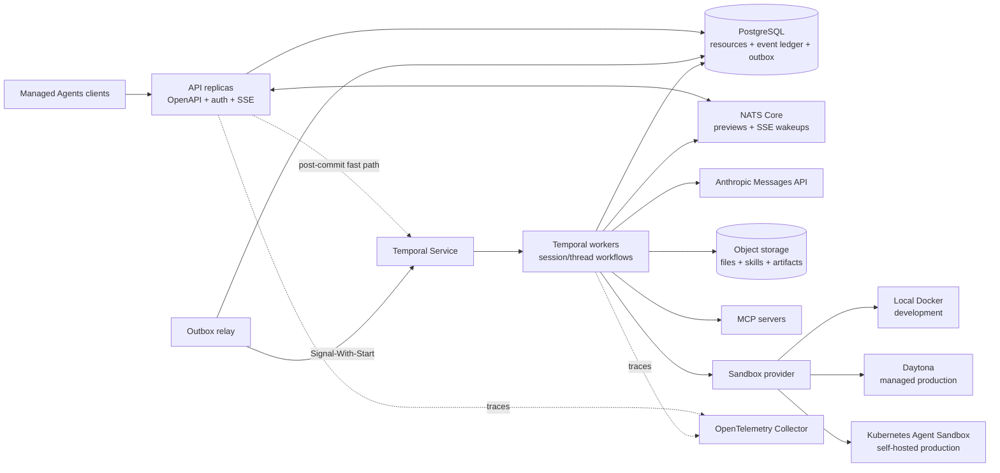

# Target platform and technology selection

Status: **Accepted after API-fit review**  
Decision date: **2026-07-28**

This document fixes the production architecture for `managed-agent-go`. It is
the decision boundary between product-specific Agent behavior that belongs in
this repository and general infrastructure that should come from mature
components.

The decision is based on Claude Managed Agents' documented external behavior.
Anthropic does not publish the implementation of its internal control plane, so
this document does **not** claim that Anthropic uses the same products named
below. The detailed behavior-by-behavior validation, including the Restate
comparison, is in the
[orchestration fit review](orchestration-fit.md).

## Decision

`managed-agent-go` will become a stateless API plus Temporal workers, backed by
PostgreSQL, object storage, NATS Core, and replaceable sandbox providers.

- **Temporal** owns durable session and thread orchestration, timers, retries,
  cancellation, human-in-the-loop waits, schedules, and webhook delivery.
- **PostgreSQL** owns externally visible resources, authoritative session
  events, projections, admission outbox, tool-execution facts, and audit
  records.
- **NATS Core** carries ephemeral previews and SSE-facing event wakeups. It is
  never a source of truth and never wakes orchestration.
- **Object storage** owns files, skills, large tool/model output, and immutable
  memory-version bodies.
- **Sandbox providers** own isolation, compute lifecycle, persistence,
  checkpointing, and network enforcement.
- The repository continues to own API compatibility, Agent domain semantics,
  event projection, tool policy, model/tool-loop decisions, and provider
  adapters.

This replaces the planned evolution of the SQLite run queue into a home-grown
distributed workflow system. The existing queue remains only as migration
scaffolding and will be removed after the Temporal path reaches behavioral
parity.

## Why this shape matches Managed Agents

The public Managed Agents model separates these concepts:

- an Agent is configuration;
- an Environment selects cloud or self-hosted execution;
- a Session is a long-lived running instance with event-based communication;
- authoritative events are persisted, while streaming deltas are best-effort
  previews;
- a self-hosted environment worker receives work from the control plane,
  provisions or reconnects execution state, runs tools, and returns results;
- multi-agent threads have isolated conversation histories while sharing a
  sandbox and selected resources.

Those boundaries imply a durable control plane and an independent execution
plane. They do not imply that this project should implement its own scheduler,
distributed queue, sandbox runtime, secrets system, or protocol stack.

## Target topology



The API and worker can still run in one binary for a simple installation. Their
process boundaries and dependencies must nevertheless stay explicit.

## Component choices

| Concern | Selected technology | Decision |
| --- | --- | --- |
| Durable orchestration | [Temporal](https://temporal.io/) with the official Go SDK | Adopt. One long-lived Workflow per session and one child Workflow per agent thread. Public event admission uses PostgreSQL/outbox plus Signals, not synchronous Updates. |
| Relational state | PostgreSQL with [`pgx`](https://github.com/jackc/pgx) | Adopt as the only production relational database. |
| SQL access | [`sqlc`](https://docs.sqlc.dev/) | Adopt generated, typed queries; keep transactions explicit. |
| Schema migrations | [`goose`](https://pressly.github.io/goose/) with embedded migrations | Adopt before any production schema evolves further. |
| HTTP contract | OpenAPI 3.0, [`oapi-codegen`](https://github.com/oapi-codegen/oapi-codegen), `chi`, and `kin-openapi` validation | Adopt spec-first request/response types and strict server interfaces. |
| Live event fan-out | [NATS Core](https://docs.nats.io/nats-concepts/core-nats) | Adopt for at-most-once previews and persisted-event wakeups. Do not introduce JetStream initially. |
| Blob portability | [Go CDK `blob`](https://gocloud.dev/howto/blob/) | Adopt. Use local `fileblob` in development and an S3-compatible/cloud driver in production. |
| MCP | [Official MCP Go SDK](https://github.com/modelcontextprotocol/go-sdk) | Adopt; do not implement MCP JSON-RPC or transports in this project. |
| Claude model access | Official Anthropic Go SDK | Keep. Prefer Anthropic server tools for supported web search, fetch, code execution, and tool search. |
| Secrets encryption | [Go CDK `secrets`](https://gocloud.dev/howto/secrets/) plus [`x/oauth2`](https://pkg.go.dev/golang.org/x/oauth2) | Adopt envelope encryption and standard OAuth refresh flows; never create a custom KMS. |
| Observability | `log/slog`, [OpenTelemetry Go](https://opentelemetry.io/docs/languages/go/), OTLP Collector | Adopt. Metrics/traces backends remain deployment choices. |
| Webhook signatures | [Standard Webhooks](https://github.com/standard-webhooks/standard-webhooks) | Adopt compatible signing/verification; Temporal owns delivery retries. |
| Production sandbox, managed | [Daytona](https://www.daytona.io/docs/en/go-sdk/) | First managed provider adapter because it has a supported Go SDK and session lifecycle primitives. |
| Production sandbox, self-hosted | [Kubernetes SIG Agent Sandbox](https://github.com/kubernetes-sigs/agent-sandbox) with Kata Containers or gVisor | First self-hosted provider adapter. Treat the project as emerging and pin/test a known release. |
| Local sandbox | Existing Docker provider | Keep for trusted development and integration tests only. |

Dependency versions are pinned when each integration lands, rather than frozen
in this architecture document.

### Current-code disposition

| Current area | Keep | Replace or move |
| --- | --- | --- |
| `internal/httpapi` | Compatibility behavior, mapping tests, SSE contract | Generate wire types/server interface from OpenAPI; add real workspace auth. |
| `internal/app` | Admission rules and public event semantics | Move dispatch, retry, waits, cancellation, and completion sequencing into Temporal Workflows. |
| `internal/store` | Repository boundaries and atomic public projections | Replace SQLite SQL with PostgreSQL/`sqlc`; replace the run queue with Workflow state. |
| `internal/agentruntime` | Model projection, tool registry, permission and pending-action semantics | Split orchestration into deterministic Workflow code and I/O into Activities. |
| `internal/sandbox` | Provider boundary, tools, Docker development implementation | Add durable provider identity and production adapters; do not implement isolation or checkpoints here. |
| In-process stream hub | SSE-facing preview/event abstraction | Replace transport with PostgreSQL cursor reads and NATS Core. |
| `cmd/managed-agent` | Manual dependency wiring and simple configuration | Add explicit `api`, `worker`, and combined development roles. |
| Tool execution journal | Prepared/started/completed/ambiguous domain facts | Remove any queue/scheduler responsibility; use it only inside idempotent Tool Activities. |

### Deliberately not selected

| Alternative | Reason |
| --- | --- |
| Continue extending the SQLite run queue | It would require reimplementing leases, fencing, timers, replay, worker versioning, retries, cancellation, and operational tooling. |
| Restate | Strong durable-execution design and a credible runner-up. Its Virtual Objects and finite turn invocations can express the core loop, but it has no native cron scheduler, its Go SDK reached 1.0 only on 2026-06-30, and it does not remove the PostgreSQL idempotency or tool-ambiguity boundaries. See the [fit review](orchestration-fit.md#restate-design-considered). |
| DBOS | Attractive PostgreSQL-native programming model, but its Go ecosystem and public evidence for this exact control-plane use case are less mature. |
| Kafka or Redis Streams | Authoritative events already live in PostgreSQL and previews are intentionally ephemeral. Their additional durable stream model is unnecessary initially. |
| NATS JetStream | It would create a second durable event log with unclear ownership. NATS Core matches preview semantics. |
| A custom MCP client | The official Go SDK already owns protocol compatibility and transports. |
| A custom object-storage interface per cloud | Go CDK already provides the required portability. |
| A custom identity provider | API keys and workspace authorization are product concerns; user identity federation should be delegated to an OIDC provider or API gateway when needed. |
| OPA/OpenFGA now | Current authorization is workspace ownership plus tool policy. Add a relationship-policy engine only when the domain actually requires one. |
| Daytona as the self-hosted OSS foundation | Daytona's production code is moving closed-source. It remains a useful managed provider, not the project's only infrastructure substrate. |
| E2B as the first provider | It is a good future managed adapter, but Daytona currently offers the cleaner Go integration for this repository. |

## Data ownership

Each fact has one authoritative owner:

| Fact | Owner | Notes |
| --- | --- | --- |
| Agent, Environment, vault metadata, deployment configuration | PostgreSQL | Regular resource CRUD; no Workflow is needed. |
| Public session and thread events | PostgreSQL | Append-only receipt order is the public API truth. |
| Admission delivery | PostgreSQL transactional outbox | A coalescible wakeup, not a second job queue; delivered with Temporal Signal-With-Start. |
| In-flight orchestration, waits, timers, cancellation | Temporal | Rebuilt by Workflow replay; not mirrored as a custom run queue. |
| Session status exposed by the API | PostgreSQL projection | Written idempotently by Workflow Activities after transitions. |
| Tool side-effect attempt state | PostgreSQL | Prepared/started/completed/ambiguous facts survive Activity retry. |
| Preview text/thinking/span deltas | NATS Core only | Best effort, non-replayable, and never persisted. |
| Files, skills, large outputs, memory version bodies | Object storage | PostgreSQL stores metadata, versions, hashes, and object references. |
| Sandbox process/filesystem/checkpoints | Sandbox provider | PostgreSQL stores only durable provider identity and capabilities. |
| Credentials | Encrypted ciphertext plus provider references | Secret plaintext is write-only and resolved only for an execution. |

Temporal is the source of truth for in-flight orchestration, not for event
admission or the public API's complete transcript. Large payloads never travel
repeatedly through Workflow history; Activities persist them and return IDs,
hashes, and object references.

## Session Workflow

Every session uses its public session ID as the stable Temporal Workflow ID.
Starting the same session again is therefore idempotent.

```text
SessionWorkflow
  initialize public projection
  wait for a wakeup Signal
  load accepted input after the durable event cursor
  for each model turn
    call ModelTurn Activity
    publish ephemeral deltas to NATS
    if built-in/MCP tool requested
      execute Tool Activity with a stable operation ID
      persist result reference
    if client action requested
      persist pending action
      wait for a resolution wakeup Signal
  persist authoritative agent output and idle status
  continue-as-new before history grows too large
```

Important invariants:

1. API admission atomically writes the ordered public events and a PostgreSQL
   outbox wakeup. The call returns after that transaction commits, even if no
   Temporal Worker is online.
2. The API makes a best-effort post-commit Signal-With-Start call and the outbox
   relay retries until Temporal durably accepts it. Duplicate wakeups are safe:
   the Workflow reads events by PostgreSQL receipt sequence after its cursor.
3. Activities use deterministic operation IDs and idempotent database writes.
   Temporal Activities may run more than once.
4. A tool can still change the external world and then lose its completion
   acknowledgment. The existing tool journal is retained to mark that outcome
   **ambiguous** and prevent a silent replay. It is not a replacement scheduler.
5. Model and tool Activities heartbeat during long operations and react to
   cancellation.
6. Only small commands and references flow through Workflow history. Large
   tool results and file data flow through object storage.
7. Workflow code stays deterministic. Network, clock, random, SQL, model, MCP,
   and sandbox calls are Activities.
8. Worker Versioning is required before changing Workflow behavior in a rolling
   deployment.

Signals are wakeups, not the event payload source of truth. This matters because
a Temporal Update does not reach its accepted stage until a Worker handles it;
the Managed Agents control plane must be able to accept and queue events while
execution workers are unavailable.

### Streaming

SSE subscribers first read authoritative events from PostgreSQL using their
cursor. They then subscribe to:

- persisted-event wakeups, after which they query PostgreSQL again; and
- ephemeral preview subjects, which can be dropped or duplicated without
  changing public history.

The authoritative buffered `agent.message` event closes any live preview.
Reconnect never attempts to replay preview deltas.

### Multi-agent

The primary session is the parent Workflow. Each agent thread is a child
Workflow with its own event stream and model history. Child workflows share
references to the same sandbox lease, files, memory stores, and vault bindings,
but they do not share implicit conversation context.

Cross-thread messages and interrupts are committed events followed by explicit
Signals. Permission and custom-tool requests are also projected into the
primary thread so a client can resolve them from one control surface.

### Schedules and webhooks

- Recurring deployments use Temporal Schedules, not an application cron loop.
- Each scheduled run creates a normal session and a deployment-run record.
- Webhook delivery is a Temporal Workflow/Activity with deterministic delivery
  IDs, exponential retry, signed payloads, and a PostgreSQL audit record.

## Sandbox strategy

The core owns a deliberately small provider contract:

```text
Create(profile, sessionID) -> durable provider ID
Attach(providerID)
Exec(operationID, command)
Read/Write/List
State/Capabilities
Pause/Resume/Checkpoint/Restore when supported
Destroy
```

Capability discovery is explicit. Checkpointing is not simulated when a
provider lacks it.

Three supported deployment profiles avoid pretending one backend fits every
case:

| Profile | Orchestration | Sandbox | Object store |
| --- | --- | --- | --- |
| Local development | `temporal server start-dev` | Existing Docker provider | `fileblob` |
| Managed production | Temporal Cloud or self-hosted Temporal | Daytona first; E2B/Modal/others can be added later | Managed S3/GCS/Azure |
| Self-hosted production | Self-hosted Temporal | Kubernetes Agent Sandbox with Kata/gVisor | S3-compatible service |

The Kubernetes provider must own pod/VM isolation and warm pools. This project
stores the sandbox identity and invokes its API; it does not recreate its
controller, checkpoint format, or low-level runtime.

## Authentication and tenancy

The compatibility API continues to accept `x-api-key`, but a key now resolves
to one workspace and permissions:

- generate high-entropy keys;
- display plaintext once;
- store only a keyed hash/fingerprint;
- scope every SQL query, object key, NATS subject, Workflow ID namespace, and
  sandbox lease to a workspace;
- keep operator/admin login behind an external OIDC provider or gateway;
- keep TLS termination, WAF rules, and coarse edge rate limits outside the Go
  application.

Tool permission evaluation remains custom because it is Agent product
semantics. Identity federation, KMS, OAuth, and sandbox credential injection do
not.

## What stays custom

These are the differentiating parts of the project:

- Claude Managed Agents wire compatibility and event variants;
- immutable Agent snapshots and Environment resolution;
- session/thread domain rules and public event projection;
- model conversation projection and context policy;
- tool registry semantics, permission rules, pending actions, and ambiguity
  handling;
- mapping Agent tools to sandbox or MCP operations;
- memory, vault, skill, outcome, and multi-agent product semantics;
- provider adapters and conformance tests.

These are infrastructure and must not be rebuilt:

- distributed scheduling and recovery;
- worker leases, fencing, replay, timers, and retry machinery;
- container/VM isolation and checkpoint formats;
- MCP protocol transports;
- SQL migration tooling and generated query plumbing;
- object-storage protocols;
- secret encryption backends and OAuth refresh;
- tracing propagation and telemetry export;
- webhook signature formats.

## Migration sequence

The migration is a series of vertical cuts, but the target stack is not
optional or exploratory:

1. **Contract and platform foundation — implemented**
   - establish an OpenAPI source of truth and generated server types;
   - add PostgreSQL, `sqlc`, and embedded `goose` migrations;
   - add transactional admission outbox rows and a retrying Signal relay;
   - add a local stack with Temporal, PostgreSQL, NATS, and file-backed blobs.
2. **One complete Temporal session — implemented for messages and
   always-allow built-ins**
   - implement `SessionWorkflow`, model and tool Activities, Signals,
     cancellation, and continue-as-new;
   - preserve the current public event order and pending-action behavior;
   - reuse the existing tool journal as Activity idempotency/ambiguity state.
3. **Cut over execution — default path implemented, compatibility gates open**
   - route new sessions through Temporal by default;
   - run black-box compatibility and restart/fault-injection tests;
   - delete the SQLite run dispatcher and in-process recovery scheduler after
     client-action and interrupt parity is proven.
4. **Split processes and live delivery — implemented except telemetry**
   - run stateless API replicas and Temporal workers independently;
   - use PostgreSQL cursor reads plus NATS Core instead of the in-process hub;
   - add OpenTelemetry across API, Workflow, model, MCP, and sandbox spans.
5. **Production execution plane**
   - add the Daytona adapter and provider conformance suite;
   - add the Kubernetes Agent Sandbox adapter for self-hosting;
   - add object-backed files/skills/memory and encrypted vault credentials.
6. **Broader Managed Agents surface**
   - implement native MCP, multi-agent child workflows, outcomes, schedules,
     and signed webhooks using the selected components.

SQLite compatibility is not a production goal. Maintaining two SQL dialects
would slow every schema change, so SQLite is removed once the PostgreSQL path
can run the existing test suite.

## Acceptance gates

The old execution path can be deleted only when the Temporal path proves:

- a lost API response can be safely retried using the same session/event ID;
- event admission succeeds and remains queued while Workflow Workers are down;
- a crash at every outbox delivery boundary loses no work and only produces
  harmless duplicate wakeups;
- worker death during model and tool Activities recovers predictably;
- non-idempotent tool ambiguity is visible and never silently replayed;
- a session can park for a client action across worker and API restarts;
- SSE history is gap-free even if NATS is unavailable;
- continue-as-new preserves public session behavior;
- API and worker versions can be rolled without breaking open workflows;
- workspace boundaries are enforced in SQL, object keys, event subjects, and
  sandbox identity.

## Source material

Managed Agents:

- [Core concepts and quickstart](https://platform.claude.com/docs/en/managed-agents/quickstart)
- [Sessions](https://platform.claude.com/docs/en/managed-agents/sessions)
- [Events and streaming](https://platform.claude.com/docs/en/managed-agents/events-and-streaming)
- [Session operations](https://platform.claude.com/docs/en/managed-agents/session-operations)
- [Self-hosted sandboxes](https://platform.claude.com/docs/en/managed-agents/self-hosted-sandboxes)
- [Tools](https://platform.claude.com/docs/en/managed-agents/tools)
- [Memory](https://platform.claude.com/docs/en/managed-agents/memory)
- [Vaults](https://platform.claude.com/docs/en/managed-agents/vaults)
- [Skills](https://platform.claude.com/docs/en/managed-agents/skills)
- [Webhooks](https://platform.claude.com/docs/en/managed-agents/webhooks)
- [Scheduled deployments](https://platform.claude.com/docs/en/managed-agents/scheduled-deployments)

Implementation evidence:

- [How Replit uses Temporal for Replit Agent](https://temporal.io/resources/case-studies/replit-uses-temporal-to-power-replit-agent-reliably-at-scale)
- [Temporal AI reference architecture](https://go.temporal.io/platform-hub/ai-engineering/ai-reference-architecture)
- [Temporal Activity execution semantics](https://docs.temporal.io/activity-definition)
- [Temporal local development server](https://docs.temporal.io/cli/command-reference/server)
- [Temporal Workflow message passing](https://docs.temporal.io/develop/go/workflows/message-passing)
- [Restate cron guide](https://docs.restate.dev/guides/cron)
- [Restate versioning](https://docs.restate.dev/services/versioning)
- [Restate Go SDK 1.0 release](https://github.com/restatedev/sdk-go/releases/tag/v1.0.0)
- [Kubernetes SIG Agent Sandbox](https://github.com/kubernetes-sigs/agent-sandbox)
- [Daytona sandbox lifecycle](https://www.daytona.io/docs/en/sandboxes/)
- [Daytona's source-model announcement](https://www.daytona.io/dotfiles/updates/daytona-is-going-closed-source)
